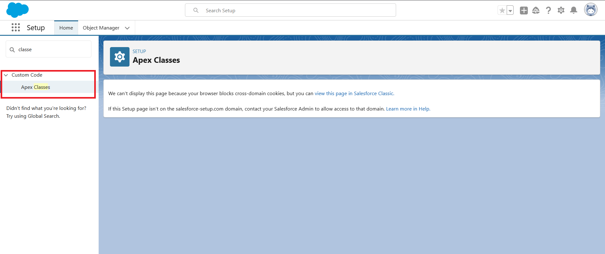
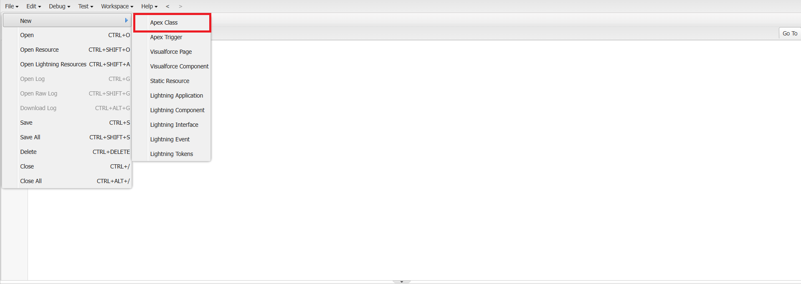

<link rel="stylesheet" type="text/css" href="../../CSS/dark-theme.css">

[Anotações](../../) > [Linguagens](../Index.md) > [Anotações Apex](./Index.md) > [Classes](./Classes.md)

# Classes
Por **[Apex](./Index.md)** ser uma linguagem baseada em [Java](../Java/Index.md), ela utiliza do paradigma da **Programação Orientada a Objetos**.

O bloco fundamental desse paradigma são as `Classes`. As classes visam representar coisas do mundo real, junto com suas características (as `propriedades`) e suas ações (os `métodos`).

As `Classes` portando servem como um molde, onde podemos instânciar `Objetos` do tipo dessa classe. Por exemplo, podemos ter uma classe **Carro**, e criar um objeto **HB20** a partir dela.

As `Classes` não necessariamente precisam representar coisas do mundo real, elas podem ser adaptadas para serem moldes de funções da aplicação. Por exemplo: uma classe chamada **Cadastro de cliente**.

## Criando uma  nova clase
Para criar uma nova classe no Salesforce temos duas opções. A primeira é através do menu de configurações, na opção **Apex Class**. Basta clicar em **new** e adicionar o código **Apex**. 



A segunda forma é diretamente através do [Developer Console](./DeveloperConsole.md). Basta clicar em **New > Apex Class** e inserir o código **Apex**.



Em relação ao código **Apex**, segue o exemplo de uma declaração de `Classe`: 

```apex
public class HelloWorld {
	String msg = 'Hello World';
    
    public void sayHello() {
       System.debug(msg); 
    } 
}
```

Em **Apex** uma classe pode ser `public` ou `global`:
- `public`: A imensa maioria das classes que você vai criar em **Apex** são do tipo public.
- `global`: Usada apenas em casos específicos para quando queremos uma classe seja visível fora do namespace/organização.

Se a classe for uma [inner class](./InnerClassOutterClass.md) existem mais opções além de `public` e `global`.

**class** é a palavra reservada para declarar uma nova classe. 

Para invocar o método sayHello() no script principal, precisamos criar um objeto da classe **Hello World**. Para isso utilizamos a palavra reservada `new` e atribuimos para uma variável do tipo ***Hello World**. Como o método sayHello() pertence a classe HelloWord, precisamos especificar o objeto seguido de um `.`:

```apex
HelloWorld hello = new HelloWorld();

hello.sayHello();
```