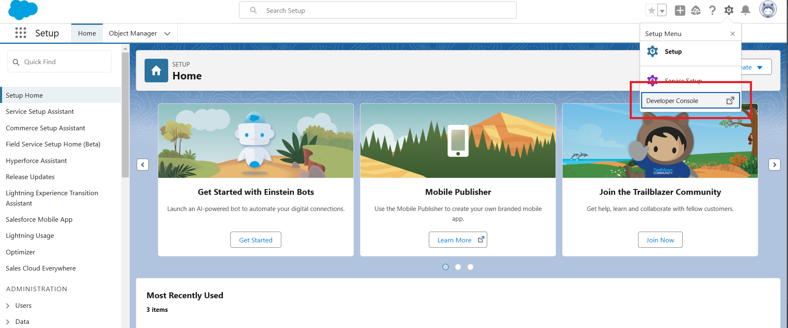

<link rel="stylesheet" type="text/css" href="../../CSS/dark-theme.css">

[Anotações](../../) > [Linguagens](../Index.md) > [Anotações Apex](./Index.md) > [Developer Console](./DeveloperConsole.md)

# Developer Console

Uma das formas de escrever códigos **Apex** é através do ambiente do **Developer Console**. Ele pode ser acessado dentro de uma organização Salesforce, através da engrenagem de configuração.

Importante lembrar que no Developer Console, não é possível escrever códigos de Lighting Web Components ou Aura Components.

