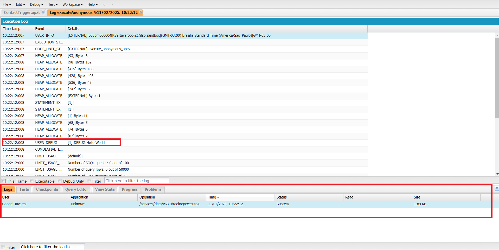

<link rel="stylesheet" type="text/css" href="../../CSS/dark-theme.css">

[Anotações](../../) > [Linguagens](../Index.md) > [Anotações Apex](./Index.md) > [Hello World](./HelloWorld.md)

# Hello World

A primeira coisa que costumamos aprender em uma nova lingaugem de programação, é como executar uma mensagem de **"Hello World"** no terminal. 

Para executar isso em **Apex**, utilizamos o seguinte comando:

```apex
System.debug('Hello World');
```

O **Developer Console** não possui um terminal integrado como muitas linguagens. O que ocorre é que ele cria literalmente um registro de log, que pode ser acessado na aba inferior de **Log**. A mensagem do usuário ficará disponível dentro do log, no event de **USER_DEBUG**. 

