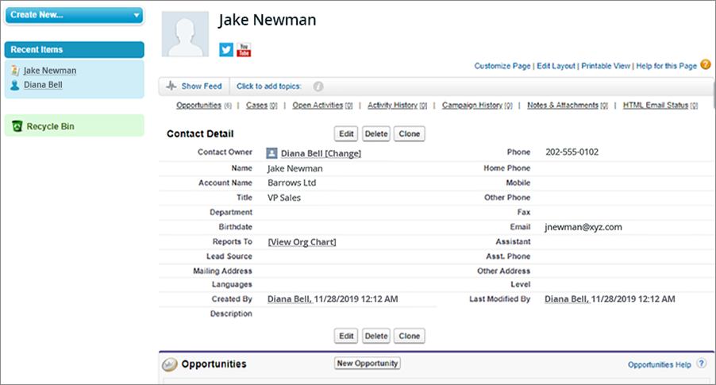
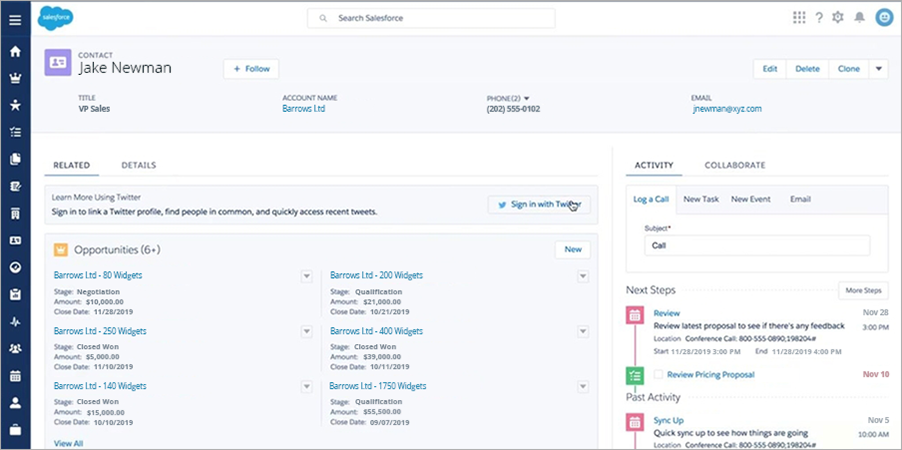

<link rel="stylesheet" type="text/css" href="../../CSS/dark-theme.css">

[Anotações](../../) > [Linguagens](../Index.md) > [Anotações Apex](./Index.md)

# Tecnologias Salesforce

Salesforce é uma plataforma de gestão de relacionamento com o cliente **(CRM)** baseada na nuvem, que ajuda empresas a gerenciar suas interações com clientes, prospects e parceiros. 

## Frontend
O Salesforce possui duas experiências quanto ao seu ambiente visual (frontend): 

### Salesforce Classic
O modelo inicial do Salesforce que estava presente em seu lançamento. As páginas visuais do Salesforce Classic são alteradas através do **Visualforce**.

### Salesforce Lighting
O Salesforce Lighting é uma versão visual mais moderna, lançada em 2014. Para criar alterações visuais nela é possível usar o **Aura Components** que é mais antigo, ou o **Lighting Web Components** que é mais recente.

## Backend

### Objetos
Objetos são o que compõe a base de dados do Salesforce, seria algo similar as tabelas de um banco de dados convencional.

### Apex
Apex é a linguagem de programação do Salesforce,  ela pode ser usada para validações e outros fins. Porém, o Apex não interage diretamente com a base de dados para isso ele se utiliza do SOQL.

### SOQL
É uma linguagem como o SQL, utilizada para fazer consultas e alterar a base de dados.