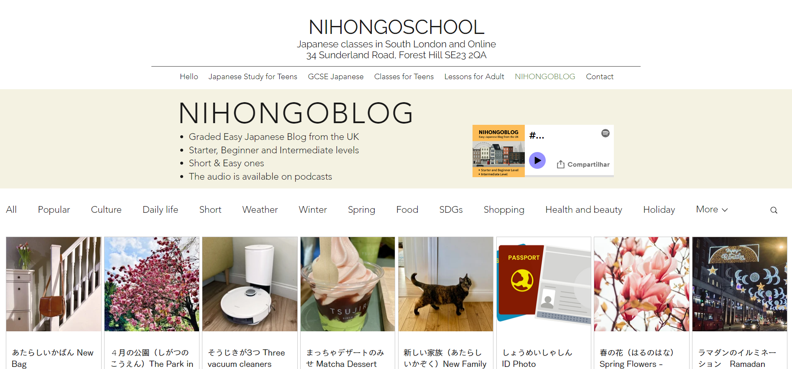
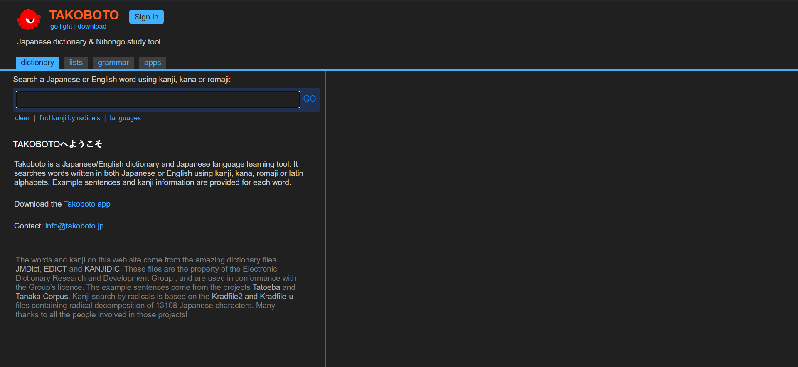
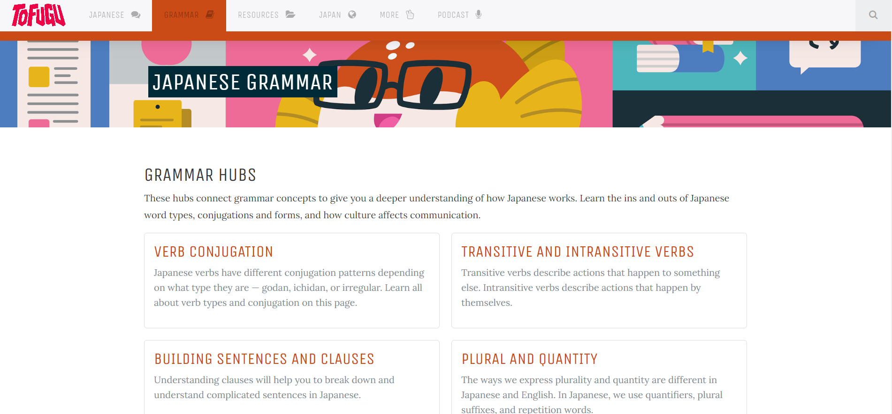
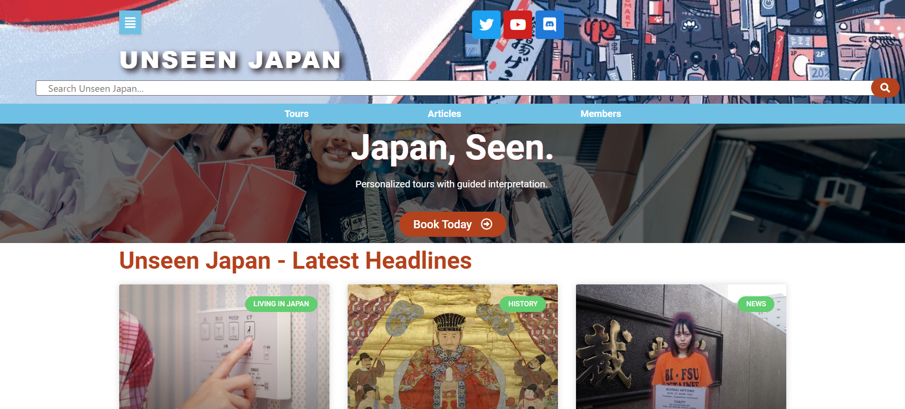

<link rel="stylesheet" type="text/css" href="../CSS/dark-theme.css">

[Anotações](../) > [Links](./Index.md) > [Links de Japones](./LinksJapones.md)

# Links úteis de Japonês

## [NIHONGOSCHOOL](https://www.nihongoschool.co.uk/nihongoblog)

Este aqui tem vários artigos simples em japonês para treinar a leitura. Preciso usar mais.

---------

## [Takoboto](https://takoboto.jp/)

Dicionário comun de japonês. É bem pratico de usar e aceita palavras em inglês e português.

----------

## [Tofugu](https://www.tofugu.com/japanese-grammar/)

Guia com vários artigos envolvendo a gramática japonesa

-----------

## [Unseen Japan](https://unseen-japan.com/)

Esse é bem legal, ele trás artigos sobre a cultura japonesa que saem um pouco do convencional visto por aqui. Da pra aprender muita coisa

--------

